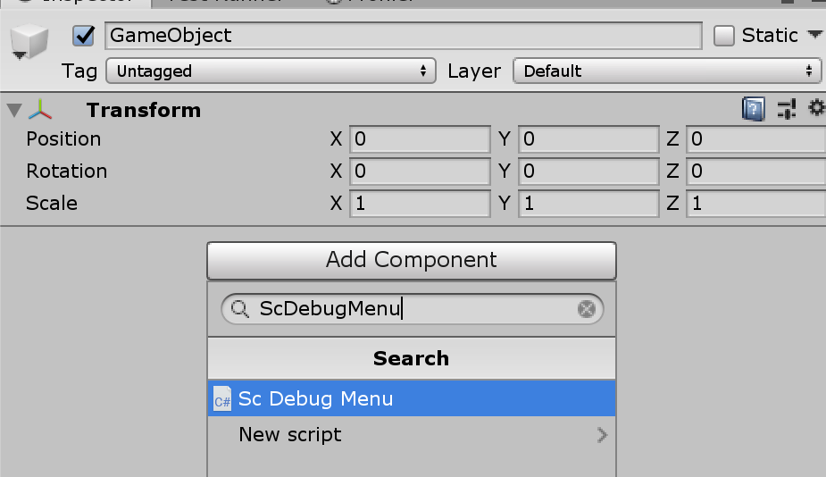
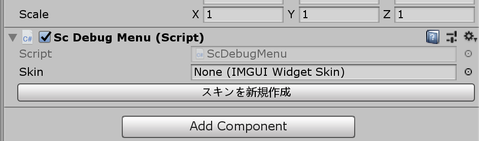
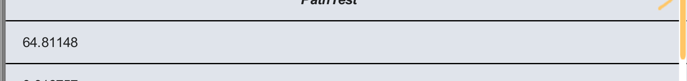
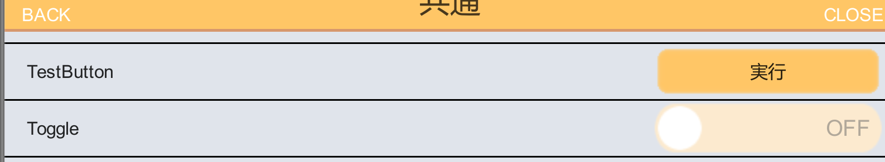
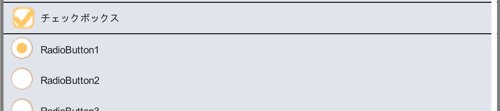
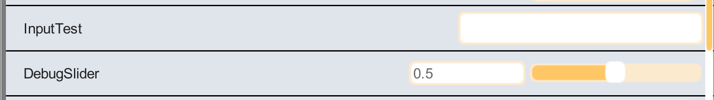
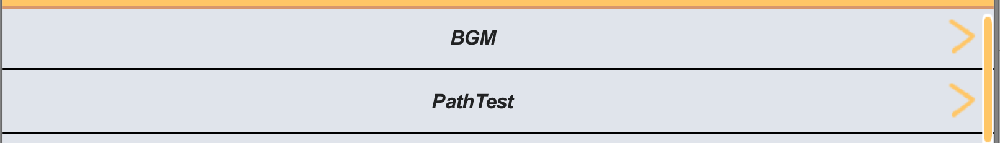

# [ScDebugMene](https://github.com/yazawa-ichio/ilib-scwidgets/tree/master/IchioLib.ScWidgets/Extension/ScDebugMenu)

ScWidget Extention Debug Menu

リポジトリ https://github.com/yazawa-ichio/ilib-scwidgets/tree/master/IchioLib.ScWidgets/Extension/ScDebugMenu

## 概要

ScWidgetsを使用したUnityのデバッグ用のメニューです。  
IMGUIベースで作られており、リリース時に切り離しやすかったり、uGUIに干渉しないのが利点です。  

 

## 導入方法

Unityのデバッグビルド時はデフォルトで利用できます。  
デバッグビルド以外の際は`ILIB_DEBUG_MENU`シンボルを利用すると利用できます。  
[こちら公式ドキュメント](https://docs.unity3d.com/ja/2018.4/Manual/PlatformDependentCompilation.html) などを参考にシンボルを定義してください。

### ScDebugMenuのセットアップ

`ScDebugMenu`コンポーネントはデバッグメニューの描写や制御を行うコンポーネントです。  
アプリケーション側から行う操作は全て`ScDebugMenu`を通して行われます。  

#### Menuのコンポーネントを追加する

プレハブやシーンのオブジェクトに`ScDebugMenu`コンポーネントを追加してください。  
おすすめはデバッグ用のシーンを作り、その中のゲームオブジェクトにコンポーネントを追加する方法です。  
シーンにして置くことで、リリースビルド時にデバッグ用のリソースを切り離すことが出来ます。

 

#### スキンを設定する

新規の場合は`スキンを新規作成`のボタンを実行してください。  
指定のフォルダにスキンのアセットを作成します。  
この際、`Resources`フォルダに入れるとビルド時に含まれるので避けてください。  
作成した後は、`ScDebugMenu`コンポーネントの`Skin`フィールドにセットします。

 

#### ScDebugMenuを表示する

メニューを開く場合は`ScDebugMenu.Open`関数を実行します。  
`ScDebugMenu`はあくまでデバッグメニューの描写を行うためのコンポーネントであるため、メニュー開閉などは追加で実装する必要があります。  

以下のような制御用のコンポーネントを作成してメニューを開きます。  
表示のトリガーはゲーム内容やプラットフォームに応じて適宜変えてください。
この例はスマホ向けのゲームを想定しています。

```csharp
using UnityEngine;
using ILib.ScWidgets;

public class DebugManager : MonoBehaviour
{
#if DEBUG || ILIB_DEBUG_MENU
	ScDebugMenu m_DebugMenu;
	
	void Awake()
	{
		m_DebugMenu = GetComponent<ScDebugMenu>();
		m_DebugMenu.Contexts.Bind(this);
	}

	void Update()
	{
#if UNITY_EDITOR
		//エディタ上だと右クリックで開く
		if (Input.GetMouseButtonUp(1))
		{
			m_DebugMenu.Open();
		}
#else
		//スマホだと四本指のタップで開く
		//ゲームにおいて利用しないタップ判定などにしておく
		if (Input.touchCount == 4)
		{
			m_DebugMenu.Open();
		}
#endif
	}
#endif
}

```

## 機能

### コンテキスト

デバッグメニューの項目は、全て対象のコンテキスト（`System.Type`）を持ち、対象のコンテキストがバインドされている時のみ表示されます。  
`ScDebugMenu.Contexts.Bind<TContext>(T obj)`関数で任意のコンテキストをバインド出来ます。  
解除する際は`ScDebugMenu.Contexts.Unbind<TContext>(T obj)`関数で行えます。  
弱参照でバインドしているため`Unbind`関数を実行しない場合でも、`GC`によって回収された場合は自動で解除されます。


この機能を利用する事でゲームのシーン（インゲーム・アウトゲーム）のみ必要なメニューを表示することが出来ます。  
まだ、常に表示するようなメニューであれば、先ほど例に出した`ScDebugMenu`を制御するコンポーネントなどを初期化時にバインドしておきます。
```csharp
public class DebugManager : MonoBehaviour
{
#if DEBUG || ILIB_DEBUG_MENU
	ScDebugMenu m_DebugMenu;
	
	void Awake()
	{
		m_DebugMenu = GetComponent<ScDebugMenu>();
		//自身をコンテキストとしてバインドする。
		m_DebugMenu.Contexts.Bind(this);
	}
~~~
~~~
}
```

### 階層構造について

デバッグメニューの項目は`Category`と`Path`を持ちます。  
`Category`は下部のメニューのタブになります。指定しない場合一番左の*共通*カテゴリーになります。  
`Path`はメニューの階層構造を作る事が出来ます。`/`毎にページ側が分かれ、ページ遷移用のメニューが作られます。  
`Path`は先頭に`@`を付ける事で通常の階層構造と切り離したページを持つことが出来ます。  

```csharp
using ILib.Debugs;

public class Sample1Button : ButtonContent<DebugManager>
{
	public override string Category => "サンプル";
	public override string Path => "ページ1/ページ2";
	protected override void OnClick() => Debug.Log("OnClick Sample1");
}

public class Sample2Button : ButtonContent<DebugManager>
{
	//Categoryを定義しない場合、共通カテゴリーになる
	//public override string Category => "サンプル";

	//ページがない場合はカテゴリーのトップページに表示される
	//public override string Path => "ページ1";
	protected override void OnClick() => Debug.Log("OnClick Sample1");
}
```

## メニューの追加

メニューの追加方法は大きく二つあります。  
デバッグ用の`Content`クラスを継承する方法と自動登録（`AutoRegisterAttribute`）属性による方法です。  
どちらも定義さえすれば`ScDebugMenu`への登録は自動で行われます。  
大半の用途では自動登録の方式で済むため、そちらを利用するのがおすすめです。

## Contentクラスを利用する

基本的に`Content`クラスを基底クラスに持つ、ボタン等の機能を実装した`ButtonContent<TContext>`を継承して利用します。
この方法を利用する利点ですが、対象のコンテキストを操作できるのがメリットです。
`Content.Context`プロパティからアクセス出来ます。

例
```csharp
using ILib.Debugs;

//クラスを定義すると自動でScDebugMenuに登録される
public class SampleInputContent : InputFieldContent<SampleContext>
{
	//項目のラベル
	protected override string Label => "サンプル入力";

	protected override string Value
	{
		get => Context.SampleInput;
		set => Context.SampleInput = value;
	}
}
```

### 情報表示系

### [LabelContent](https://yazawa-ichio.github.io/ilib-unity-project/api/LabelContent-1.html)

 

### ボタン系

### [ButtonContnt](https://yazawa-ichio.github.io/ilib-unity-project/api/ILib.Debugs.ButtonContent-1.html)
### [ToggleContent](https://yazawa-ichio.github.io/ilib-unity-project/api/ToggleContent-1.html)

 

### [CheckBoxContent](https://yazawa-ichio.github.io/ilib-unity-project/api/ILib.Debugs.CheckBoxContent-1.html)
### [RadioButtonContent](https://yazawa-ichio.github.io/ilib-unity-project/api/RadioButtonContent-1.html)

 

### 入力系

### [InputFieldContent](https://yazawa-ichio.github.io/ilib-unity-project/api/ILib.Debugs.InputFieldContent-1.html)
### [IntFieldContent](https://yazawa-ichio.github.io/ilib-unity-project/api/IntFieldContent-1.html)
### [IntSliderContent](https://yazawa-ichio.github.io/ilib-unity-project/api/IntSliderContent-1.html)
### [FloatFieldContent](https://yazawa-ichio.github.io/ilib-unity-project/api/ILib.Debugs.FloatFieldContent-1.html)
### [FloatSliderContent](https://yazawa-ichio.github.io/ilib-unity-project/api/ILib.Debugs.FloatSliderContent-1.html)

 

#### 特殊

### [PageJumpContent](https://yazawa-ichio.github.io/ilib-unity-project/api/PageJumpContent-1.html)

`@`指定を行ったページに遷移するための機能です。



## 自動登録(`AutoRegister`)を利用する

名前空間`ILib.Debugs.AutoRegisters`の属性をクラスやメソッドに指定する事でメニューを作成する事が出来ます。  
`Content`を継承する場合はより複雑な実装が可能ですが、大半の用途ではこちらの方法で指定できます。  
この方での指定ではコンテキスト内のプロパティやメソッドしか項目を追加できません。

### コンテキストを指定する

コンテキストとして扱いたいクラスに`AutoRegisterTarget`属性を追加します。  
これによりプロパティやメソッドが自動登録の対象にする事が出来ます。  
`ScDebugMenu.Contexts.Bind`関数でインスタンスを登録する箇所などは変わりありません。

```csharp
using UnityEngine;
using ILib.Debugs;
using ILib.Debugs.AutoRegisters;

[AutoRegisterTarget]
public class AutoSampleContext
{
	[DebugToggle("AutoRegisterToggle")]
	public bool ToggleValue{ get; set; }

	[DeubgButton("AutoRegisterButton")]
	void OnDebugButton()
	{
		Debug.Log("OnDebugButton");
	}
}
```

### 項目を追加する

`AutoRegisterTarget`属性を追加したクラスに対して、中のプロパティや関数に属性を追加すると自動でメニューが追加されます。  
自動実装出来る機能は以下の表で確認できます。  

|名前|対象|機能|
|---|---|---|
|DebugLabel|関数(return string)|文字列表示|
|DebugButton|関数(return void)|関数実行|
|DebugSlider|フィールドorプロパティ(float or int)|数値スライダー|
|DebugInput|フィールドorプロパティ(string)|文字列入力|
|DebugToggle|フィールドorプロパティ(bool)|トグル|

カテゴリーやパスに関しても属性のプロパティ経由で設定できます。

```csharp
using UnityEngine;
using ILib.Debugs;
using ILib.Debugs.AutoRegisters;

[AutoRegisterTarget]
public class AutoSampleContext
{
	int m_Count;
	[DeubgButton("CountUp", Category = "カテゴリー")]
	void OnCountUp()
	{
		m_Count++
	}
	[DebugLabel("Count", Path = "Path1/Path2")]
	string GetCount()
	{
		return "Count " + m_Count;
	}
}
```