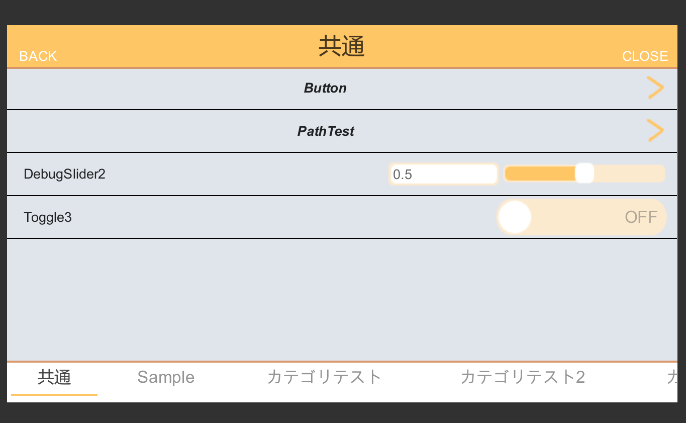

# [ilib-scwidget(WIP)](https://github.com/yazawa-ichio/ilib-scwidget)

Unity Tool Scripting Widget Package

リポジトリ https://github.com/yazawa-ichio/ilib-scwidget

## 概要
Unity用のツール用のウィジェット。  
デバッグメニューやGUILayoutでは実装が難しいツールGUIを作るために作成。  
UIElementsがランタイムで動くのを待てないので作った。  
そろそろランタイムで動きそうなので要らない子。  

拡張実装として作ったデバッグメニューが、いい感じに出来たのでそちらのみドキュメントを追加します。

### ScDebugMenu

[ドキュメント](debug-menu.md)

 

## LICENSE

https://github.com/yazawa-ichio/ilib-scwidget/blob/master/LICENSE